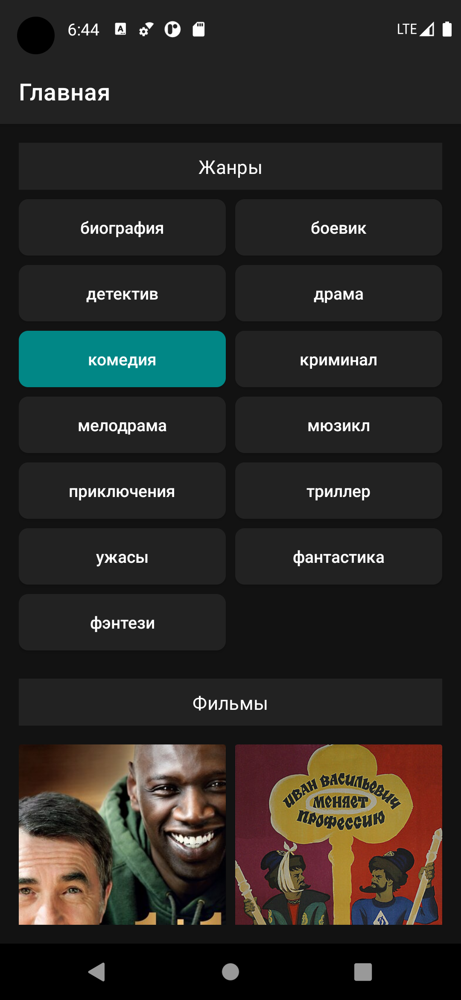
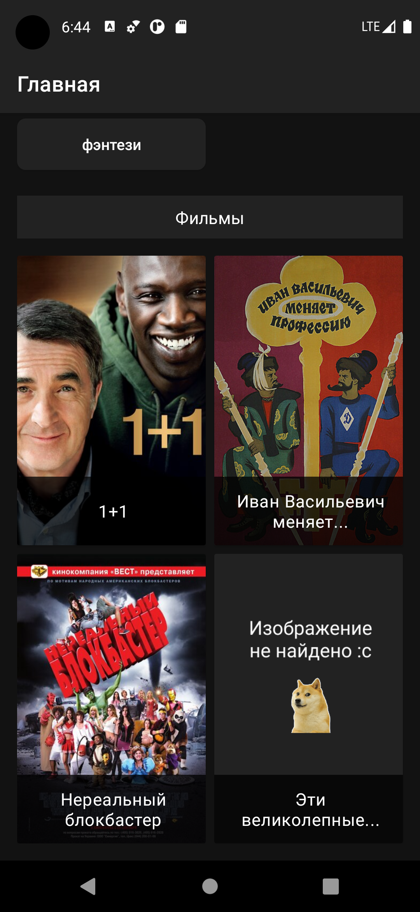
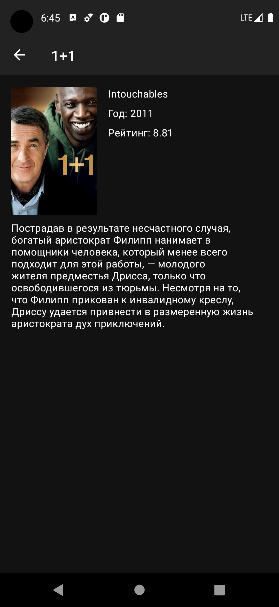

## Films app

This app demonstrates the following views and techniques:

* Retrofit - to make api calls to an HTTP web service
* Moshi - which handles the deserialization of the returned JSON to Kotlin data objects 
* OkHttp - to logging
* Glide - to load and cache images by URL.
* Recycler View - with Diffutils for correct display of elements when they are changed
* Data Binding in XML files
* Binding Adapters
* MVP architectural pattern
* Single activity pattern

It leverages the following components from the Jetpack library:
* Navigation - with the SafeArgs plugin for parameter passing between fragments
* ViewModel - to save the state when the fragment is recreated and when the fragment is overlapped

## What can be improved
* Add Dependency Injection
* Add JUnit testing
* Add Kotlin coroutins 
* Add sealed class state(Loading, Success, Failure) and observe its states
* Add swape refresh layout

## Screenshots

